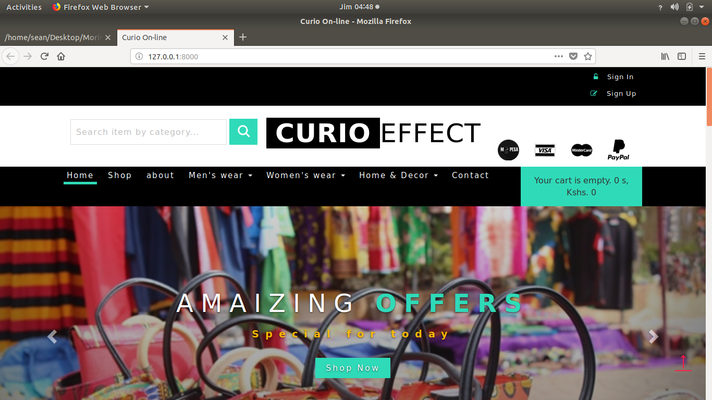
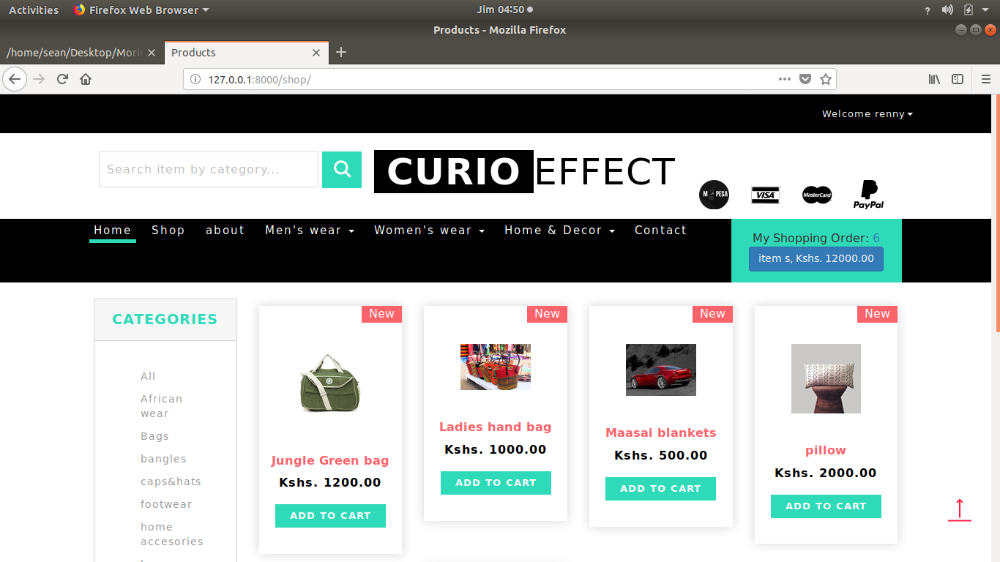
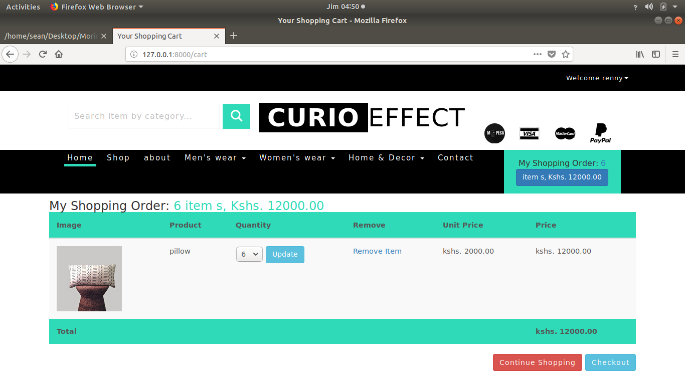

# OMS FOR ONLINE SHOP (currio effect)
#### This is an onlineshop application that allows different users to view items on sale and make an order online. Admins are able to view orders made and process orders

#### By ****Enock OMONDI****

## Requirements
* Browser
* Good internet connection

## How to use as a user
* Open the site - link [here]()
* Create an account if you are new or login to application
* Search for different items 
* Click on desired Item to view
* add to cart and submit to make an order

## How to use as admin
* Open the site - link [here]()
* login to application
* Search for different orders made
* Click on desired Item order to process
* 

## Technologies used
* Django - The web framework used
* Python - Language
* html/css/bootstrap4- Used for-frontend
* Postgresql-Database

###### Deployment
* HEROKU

### KNOWN BUGS
- no known bugs

 
Github - [Enock OMONDI](https://github.com/EnockOMONDI)

### License
This is an opensource software therefore the license is [MIT](https://choosealicense.com/licenses/mit/)
 
Copyright (c) 2018 